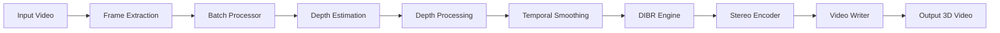

# 2Dto3D Video Converter - Developer Guide

**Version:** 0.1.0  
**Last Updated:** March 2026

> This guide is intended for developers who want to understand, extend, or contribute to the 2Dto3D Video Converter project.

## Table of Contents

1. [Architecture Overview](#architecture-overview)
2. [Project Structure](#project-structure)
3. [Core Modules](#core-modules)
4. [Data Flow](#data-flow)
5. [Extending the System](#extending-the-system)
6. [API Reference](#api-reference)
7. [Testing](#testing)
8. [Debugging](#debugging)

---

## Architecture Overview

### High-Level Architecture

```
┌─────────────────────────────────────────────────────────────────────────────┐
│                              User Interface Layer                            │
├─────────────────┬─────────────────┬─────────────────┬───────────────────────┤
│     CLI         │    Web API      │   Desktop GUI   │    Web Dashboard      │
│   (cli.py)      │   (web/app.py)  │   (gui/)        │    (frontend/)        │
└────────┬────────┴────────┬────────┴────────┬────────┴──────────┬────────────┘
         │                 │                 │                    │
         ▼                 ▼                 ▼                    ▼
┌─────────────────────────────────────────────────────────────────────────────┐
│                           Core Processing Layer                              │
├─────────────────────────────────────────────────────────────────────────────┤
│                                                                             │
│  ┌─────────────────┐  ┌─────────────────┐  ┌─────────────────┐             │
│  │  Video Handler  │──▶  Depth Engine   │──▶  Stereo Engine  │             │
│  │  (video/)       │  │  (depth/)       │  │  (stereo/)      │             │
│  └─────────────────┘  └─────────────────┘  └─────────────────┘             │
│           │                   │                    │                        │
│           ▼                   ▼                    ▼                        │
│  ┌─────────────────┐  ┌─────────────────┐  ┌─────────────────┐             │
│  │ Frame Extractor │  │ Depth Processor │  │ Output Encoders │             │
│  │ Video Writer    │  │ Temporal Smooth │  │ SBS/Anaglyph/VR │             │
│  └─────────────────┘  └─────────────────┘  └─────────────────┘             │
│                                                                             │
└─────────────────────────────────────────────────────────────────────────────┘
         │                 │                 │                    │
         ▼                 ▼                 ▼                    ▼
┌─────────────────────────────────────────────────────────────────────────────┐
│                           Infrastructure Layer                               │
├─────────────────┬─────────────────┬─────────────────┬───────────────────────┤
│   Batch Queue   │   GPU Manager   │  Config System  │   Logging System      │
│  (batch/)       │  (utils/gpu)    │ (utils/config)  │  (utils/logger)       │
├─────────────────┼─────────────────┼─────────────────┼───────────────────────┤
│ Error Recovery  │ Memory Monitor  │  Crash Reporter │   Preset Manager      │
│(utils/error)    │(utils/memory)   │   (crash/)      │   (presets/)          │
└─────────────────┴─────────────────┴─────────────────┴───────────────────────┘
```

### Processing Pipeline

The video conversion follows a well-defined pipeline:



---

## Project Structure

```
2dto3d/
├── config/                     # Configuration files
│   ├── default.yaml           # Default settings
│   ├── development.yaml       # Development overrides
│   └── production.yaml        # Production overrides
│
├── src/video2d3d/             # Main source code
│   ├── __init__.py
│   ├── __main__.py            # Entry point for python -m
│   ├── cli.py                 # Command-line interface
│   ├── _version.py            # Version information
│   │
│   ├── core/                  # Core processing logic
│   │   ├── __init__.py
│   │   └── batch_processor.py # Parallel batch processing
│   │
│   ├── video/                 # Video I/O handling
│   │   ├── __init__.py
│   │   ├── handler.py         # Main video handler
│   │   ├── frame_extractor.py # Frame extraction from videos
│   │   ├── video_writer.py    # Video output writer
│   │   ├── metadata.py        # Video metadata utilities
│   │   └── exceptions.py      # Video-specific exceptions
│   │
│   ├── depth/                 # Depth estimation modules
│   │   ├── __init__.py
│   │   ├── processor.py       # Depth map post-processing
│   │   ├── temporal.py        # Temporal smoothing
│   │   ├── adadepth.py        # AdaDepth model integration
│   │   ├── zoedepth.py        # ZoeDepth model integration
│   │   ├── ensemble.py        # Depth ensemble methods
│   │   ├── curve.py           # Depth curve adjustments
│   │   └── model_selector.py  # Dynamic model selection
│   │
│   ├── stereo/                # Stereoscopic generation
│   │   ├── __init__.py
│   │   ├── dibr.py            # Depth-Image-Based Rendering
│   │   ├── side_by_side.py    # Side-by-side encoder
│   │   ├── anaglyph.py        # Anaglyph encoder
│   │   ├── interlaced.py      # Interlaced encoder
│   │   ├── checkerboard.py    # Checkerboard encoder
│   │   ├── top_bottom.py      # Top-bottom encoder
│   │   └── vr.py              # VR format encoder
│   │
│   ├── audio/                 # Audio processing
│   │   ├── __init__.py
│   │   ├── processor.py       # Audio processing pipeline
│   │   ├── tracks.py          # Audio track handling
│   │   ├── spatial.py         # Spatial audio
│   │   ├── multichannel.py    # Multichannel audio
│   │   ├── metadata.py        # Audio metadata
│   │   ├── config.py          # Audio configuration
│   │   ├── constants.py       # Audio constants
│   │   └── exceptions.py      # Audio exceptions
│   │
│   ├── web/                   # Web API server
│   │   ├── __init__.py
│   │   ├── app.py             # FastAPI application
│   │   ├── schemas.py         # Pydantic schemas
│   │   ├── health.py          # Health check endpoints
│   │   ├── state.py           # Application state
│   │   ├── rate_limit.py      # Rate limiting
│   │   ├── exceptions.py      # API exceptions
│   │   ├── utils.py           # API utilities
│   │   └── routers/           # API routers
│   │       ├── __init__.py
│   │       ├── jobs.py        # Job management
│   │       ├── uploads.py     # File uploads
│   │       ├── downloads.py   # File downloads
│   │       └── crash.py       # Crash reports
│   │
│   ├── batch/                 # Batch processing
│   │   ├── __init__.py
│   │   ├── queue.py           # Job queue management
│   │   ├── models.py          # Batch job models
│   │   ├── config.py          # Batch configuration
│   │   ├── file_discovery.py  # File discovery
│   │   ├── folder_watcher.py  # Folder watching
│   │   ├── exceptions.py      # Batch exceptions
│   │   └── adaptive_sizer.py  # Adaptive batch sizing
│   │
│   ├── gui/                   # Desktop GUI (PyQt)
│   │   ├── __init__.py
│   │   ├── main_window.py     # Main application window
│   │   ├── convert_tab.py     # Conversion tab
│   │   ├── batch_tab.py       # Batch processing tab
│   │   ├── settings_tab.py    # Settings tab
│   │   ├── workers.py         # Background workers
│   │   └── widgets.py         # Custom widgets
│   │
│   ├── preview/               # Preview functionality
│   │   ├── __init__.py
│   │   └── preview_window.py  # Live preview window
│   │
│   ├── utils/                 # Utility modules
│   │   ├── __init__.py
│   │   ├── config.py          # Configuration management
│   │   ├── logger.py          # Logging utilities
│   │   ├── gpu.py             # GPU management
│   │   ├── progress.py        # Progress tracking
│   │   ├── error_recovery.py  # Error recovery utilities
│   │   └── memory_monitor.py  # Memory monitoring
│   │
│   ├── crash/                 # Crash reporting
│   │   ├── __init__.py
│   │   ├── reporter.py        # Crash reporter
│   │   ├── models.py          # Crash report models
│   │   └── state_capture.py   # State capture
│   │
│   ├── benchmark/             # Benchmarking tools
│   │   ├── __init__.py
│   │   ├── runner.py          # Benchmark runner
│   │   ├── results.py         # Benchmark results
│   │   ├── reporting.py       # Result reporting
│   │   └── config.py          # Benchmark config
│   │
│   ├── presets/               # Preset management
│   │   ├── __init__.py
│   │   ├── manager.py         # Preset manager
│   │   ├── storage.py         # Preset storage
│   │   ├── models.py          # Preset models
│   │   └── builtins.py        # Built-in presets
│   │
│   ├── checkpoint/            # Checkpoint/resume
│   │   ├── __init__.py
│   │   ├── manager.py         # Checkpoint manager
│   │   └── models.py          # Checkpoint models
│   │
│   ├── opticalflow/           # Optical flow engine
│   │   ├── __init__.py
│   │   └── engine.py          # Optical flow computation
│   │
│   └── segmentation/          # Segmentation processor
│       ├── __init__.py
│       ├── processor.py       # Segmentation processing
│       └── integrator.py      # Segmentation integration
│
├── frontend/                  # Web dashboard (React/TypeScript)
│   ├── src/
│   ├── public/
│   ├── package.json
│   └── README.md
│
├── tests/                     # Test suite
│   ├── unit/                  # Unit tests
│   ├── integration/           # Integration tests
│   └── fixtures/              # Test fixtures
│
├── docs/                      # Documentation
│   ├── USER_GUIDE.md         # User documentation
│   └── DEVELOPER_GUIDE.md    # This file
│
├── models/                    # Pre-trained models (downloaded)
├── inputs/                    # Input videos directory
├── outputs/                   # Output videos directory
├── logs/                      # Log files directory
│
├── requirements.txt           # Production dependencies
├── requirements-dev.txt       # Development dependencies
├── pyproject.toml            # Project configuration
├── setup.py                  # Package setup
├── Dockerfile                # GPU Docker image
├── Dockerfile.cpu            # CPU-only Docker image
├── docker-compose.yml        # Docker Compose (GPU)
└── docker-compose.cpu.yml    # Docker Compose (CPU)
```

---

## Core Modules

### 1. Video Module (`src/video2d3d/video/`)

Handles all video input/output operations.

#### Key Components

| Component | Description |
|-----------|-------------|
| `VideoHandler` | Main class for video processing workflow |
| `FrameExtractor` | Extracts individual frames from video files |
| `VideoWriter` | Writes processed frames to output video |
| `VideoMetadata` | Extracts and manages video metadata |

#### Usage Example

```python
from video2d3d.video import FrameExtractor, VideoWriter

# Extract frames from a video
extractor = FrameExtractor("input.mp4")
for frame_idx, frame in extractor.extract_frames():
    # Process frame
    processed_frame = process(frame)
    # Write to output
    break

# Write frames to video
writer = VideoWriter(
    "output.mp4",
    fps=30,
    resolution=(1920, 1080),
    codec="libx264"
)
for frame in processed_frames:
    writer.write_frame(frame)
writer.close()
```

### 2. Depth Module (`src/video2d3d/depth/`)

Handles depth estimation and post-processing.

#### Key Components

| Component | Description |
|-----------|-------------|
| `DepthMapProcessor` | Post-processes depth maps (normalization, filtering) |
| `TemporalSmoother` | Smooths depth across video frames |
| `DepthModelSelector` | Dynamically selects depth models |
| `DepthEnsemble` | Combines multiple depth estimates |

#### Depth Processing Pipeline

```python
from video2d3d.depth import DepthMapProcessor, DepthProcessorConfig

# Configure depth processing
config = DepthProcessorConfig(
    edge_aware_smoothing=True,
    bilateral_filter=True,
    hole_filling=True,
    hole_filling_method="inpaint",
    normalization_method="percentile",
    colormap="turbo"
)

processor = DepthMapProcessor(config=config)

# Process a depth map
processed_depth = processor.process(raw_depth_map, apply_colormap=False)

# Individual operations
normalized = processor.normalize(raw_depth_map, method="min_max")
filtered = processor.apply_bilateral_filter(normalized)
filled = processor.fill_holes(filtered)
colored = processor.apply_colormap(filled, colormap="plasma")
```

### 3. Stereo Module (`src/video2d3d/stereo/`)

Generates stereoscopic 3D views from depth maps.

#### Key Components

| Component | Description |
|-----------|-------------|
| `DIBREngine` | Depth-Image-Based Rendering for stereo generation |
| `SideBySideEncoder` | Left-right stereo format |
| `AnaglyphEncoder` | Red-cyan anaglyph format |
| `InterlacedEncoder` | Row-alternating format |
| `VREncoder` | VR over-under format |

#### DIBR Rendering

```python
from video2d3d.stereo import DIBREngine, DIBRConfig

# Configure DIBR
config = DIBRConfig(
    baseline=0.05,           # Camera separation (3D effect strength)
    focal_length=1.0,        # Virtual focal length
    convergence=0.5,         # Zero parallax distance
    hole_filling="inpaint",  # How to fill disocclusions
    depth_interpretation="inverse"  # MiDaS-style depth
)

engine = DIBREngine(config=config)

# Generate stereo pair
left_view, right_view = engine.render(frame, depth_map)

# Get disparity map for visualization
disparity = engine.compute_disparity(depth_map, image_width=1920)
```

### 4. Core Module (`src/video2d3d/core/`)

Provides parallel batch processing capabilities.

#### Batch Processing

```python
from video2d3d.core import (
    FrameBatchProcessor,
    BatchProcessorConfig,
    ProcessingMode
)

# Configure batch processing
config = BatchProcessorConfig(
    batch_size=8,
    num_workers=4,
    mode=ProcessingMode.MULTIPROCESSING,
    timeout_seconds=300.0,
    max_retries=2,
    preserve_order=True
)

processor = FrameBatchProcessor(config=config)

# Process frames in parallel
def depth_estimation(frame):
    return estimate_depth(frame)

result = processor.process(frames, depth_estimation)

# Access results
for output in result.get_successful_outputs():
    save_output(output)

# Check for errors
for idx, error in result.errors:
    print(f"Frame {idx} failed: {error}")

print(f"Success rate: {result.success_rate:.1f}%")
print(f"Throughput: {result.items_per_second:.1f} fps")
```

### 5. Web API Module (`src/video2d3d/web/`)

REST API server built with FastAPI.

#### Key Endpoints

| Endpoint | Method | Description |
|----------|--------|-------------|
| `/health` | GET | Health check |
| `/api/v1/upload/` | POST | Upload video file |
| `/api/v1/jobs/` | POST | Submit conversion job |
| `/api/v1/jobs/{id}` | GET | Get job status |
| `/api/v1/jobs/{id}/cancel` | POST | Cancel job |
| `/api/v1/download/{id}` | GET | Download result |

#### Starting the Server

```python
# Command line
video2d3d serve --host 0.0.0.0 --port 8000

# Programmatically
from video2d3d.web.app import create_app
import uvicorn

app = create_app()
uvicorn.run(app, host="0.0.0.0", port=8000)
```

### 6. Batch Module (`src/video2d3d/batch/`)

Manages job queues and batch processing.

```python
from video2d3d.batch import BatchQueue, BatchJobConfig

# Create batch queue
queue = BatchQueue(
    max_concurrent_jobs=1,
    auto_start=True,
    save_state=True
)

# Add job to queue
job_config = BatchJobConfig(
    input_path="video.mp4",
    output_path="video_3d.mp4",
    stereo_format="side_by_side",
    depth_model="midas_small"
)
job_id = queue.add_job(job_config)

# Monitor queue status
status = queue.get_status()
print(f"Pending: {status.pending_jobs}")
print(f"Running: {status.running_jobs}")
print(f"Completed: {status.completed_jobs}")
```

---

## Data Flow

### Frame Processing Flow

```
┌──────────────────────────────────────────────────────────────────┐
│                        FRAME PROCESSING FLOW                      │
└──────────────────────────────────────────────────────────────────┘

Input Video (MP4, AVI, etc.)
         │
         ▼
┌─────────────────────┐
│  Frame Extraction   │  Extract individual frames using OpenCV
│  (FrameExtractor)   │  - Decode video stream
└──────────┬──────────┘  - Yield frames with timestamps
           │
           ▼
┌─────────────────────┐
│   Batch Processing  │  Process frames in parallel batches
│  (BatchProcessor)   │  - Multiprocessing for CPU-bound tasks
└──────────┬──────────┘  - Progress tracking
           │
           ▼
┌─────────────────────┐
│  Depth Estimation   │  Estimate depth using ML models
│  (MiDaS, DPT, etc.) │  - GPU acceleration when available
└──────────┬──────────┘  - Model caching
           │
           ▼
┌─────────────────────┐
│  Depth Processing   │  Post-process depth maps
│ (DepthMapProcessor) │  - Normalization
└──────────┬──────────┘  - Edge-aware smoothing
           │             - Hole filling
           ▼
┌─────────────────────┐
│ Temporal Smoothing  │  Smooth depth across frames
│ (TemporalSmoother)  │  - Consistent depth over time
└──────────┬──────────┘  - Reduces flickering
           │
           ▼
┌─────────────────────┐
│   DIBR Rendering    │  Generate stereo views
│    (DIBREngine)     │  - Compute disparity
└──────────┬──────────┘  - Warp images
           │             - Fill disocclusions
           ▼
┌─────────────────────┐
│  Stereo Encoding    │  Encode stereo format
│ (SBS, Anaglyph, VR) │  - Side-by-side
└──────────┬──────────┘  - Anaglyph
           │             - Interlaced
           ▼             - VR formats
┌─────────────────────┐
│    Video Writing    │  Write output video
│   (VideoWriter)     │  - Encode with FFmpeg
└──────────┬──────────┘  - Preserve audio
           │
           ▼
Output Video (3D MP4, etc.)
```

---

## Extending the System

### Adding a New Depth Model

1. Create a new model adapter in `src/video2d3d/depth/`:

```python
# src/video2d3d/depth/my_model.py

from typing import Optional
import numpy as np
import torch

class MyDepthModel:
    """Custom depth estimation model."""
    
    def __init__(self, model_path: Optional[str] = None, device: str = "cuda"):
        self.device = device
        self.model = self._load_model(model_path)
    
    def _load_model(self, model_path: Optional[str]):
        # Load your model here
        pass
    
    def estimate_depth(self, frame: np.ndarray) -> np.ndarray:
        """Estimate depth from a single frame.
        
        Args:
            frame: Input image (H, W, 3) in RGB format, uint8.
            
        Returns:
            Depth map (H, W) as float32, values in [0, 1] where
            1 = far, 0 = close (inverse depth interpretation).
        """
        # Preprocess
        input_tensor = self._preprocess(frame)
        
        # Run inference
        with torch.no_grad():
            output = self.model(input_tensor)
        
        # Postprocess
        depth = self._postprocess(output)
        
        return depth
```

2. Register the model in `model_selector.py`:

```python
# src/video2d3d/depth/model_selector.py

SUPPORTED_MODELS = {
    # ... existing models ...
    "my_model": {
        "class": "video2d3d.depth.my_model.MyDepthModel",
        "description": "My custom depth model",
        "quality": "custom",
        "speed": "custom",
    }
}
```

3. Add configuration support in `config/default.yaml`:

```yaml
depth_estimation:
  model: my_model  # or midas_small, dpt_large, etc.
```

### Adding a New Stereo Output Format

1. Create a new encoder in `src/video2d3d/stereo/`:

```python
# src/video2d3d/stereo/my_format.py

import numpy as np
from typing import Tuple

class MyFormatEncoder:
    """Encoder for custom stereo format."""
    
    def encode(
        self, 
        left_view: np.ndarray, 
        right_view: np.ndarray
    ) -> np.ndarray:
        """Encode left and right views into custom format.
        
        Args:
            left_view: Left eye view (H, W, 3)
            right_view: Right eye view (H, W, 3)
            
        Returns:
            Encoded stereo image
        """
        # Implement your encoding logic
        encoded = self._custom_encode(left_view, right_view)
        return encoded
    
    def _custom_encode(self, left: np.ndarray, right: np.ndarray) -> np.ndarray:
        # Your encoding implementation
        pass
```

2. Register in `__init__.py`:

```python
# src/video2d3d/stereo/__init__.py

from video2d3d.stereo.my_format import MyFormatEncoder

__all__ = [
    # ... existing exports ...
    "MyFormatEncoder",
]
```

3. Add CLI support in `cli.py`:

```python
# In convert command
format_choices = [
    "side_by_side", 
    "anaglyph", 
    "interlaced", 
    "my_format"  # Add your format
]
```

### Adding a New CLI Command

```python
# src/video2d3d/cli.py

import click

@click.group()
def cli():
    """2Dto3D Video Converter CLI."""
    pass

@cli.command()
@click.argument('input_file', type=click.Path(exists=True))
@click.option('--output', '-o', required=True, help='Output file path')
@click.option('--option', '-opt', default='default', help='Custom option')
def my_command(input_file: str, output: str, option: str):
    """Description of my custom command.
    
    Extended description with usage examples.
    """
    # Implementation
    click.echo(f"Processing {input_file} -> {output}")
    # ... your logic ...
    click.echo("Done!")

# Register with main CLI group
cli.add_command(my_command)
```

---

## API Reference

### Configuration Classes

#### BatchProcessorConfig

```python
@dataclass
class BatchProcessorConfig:
    batch_size: int = 8          # Items per batch
    num_workers: int = 4         # Parallel workers
    mode: ProcessingMode = ProcessingMode.MULTIPROCESSING
    chunk_size: int = 1          # Items per chunk
    timeout_seconds: float = 300.0
    max_retries: int = 2
    preserve_order: bool = True
    enable_progress: bool = True
```

#### DepthProcessorConfig

```python
@dataclass
class DepthProcessorConfig:
    edge_aware_smoothing: bool = True
    smoothing_radius: int = 3
    bilateral_filter: bool = True
    bilateral_sigma_color: float = 0.1
    bilateral_sigma_space: int = 5
    hole_filling: bool = True
    hole_filling_method: str = "inpaint"  # "inpaint", "nearest", "linear"
    normalization_method: str = "min_max"  # "min_max", "percentile", "histogram_equalization"
    colormap: str = "turbo"
```

#### DIBRConfig

```python
@dataclass
class DIBRConfig:
    baseline: float = 0.05        # Camera separation
    focal_length: float = 1.0     # Virtual focal length
    convergence: float = 0.5      # Zero parallax distance (0-1)
    hole_filling: str = "nearest" # "none", "nearest", "linear", "inpaint"
    depth_interpretation: str = "inverse"  # "inverse" or "direct"
    max_disparity: int = 64       # Maximum disparity in pixels
```

### Exception Classes

| Exception | Description |
|-----------|-------------|
| `BatchProcessorError` | Base error for batch processing |
| `WorkerTimeoutError` | Worker exceeded timeout |
| `DepthProcessingError` | Error in depth processing |
| `DIBRError` | Error in DIBR rendering |
| `VideoProcessingError` | Error in video processing |

---

## Testing

### Running Tests

```bash
# Run all tests
pytest

# Run with coverage
pytest --cov=video2d3d --cov-report=html

# Run specific test file
pytest tests/unit/test_depth_processor.py

# Run specific test
pytest tests/unit/test_depth_processor.py::test_normalization

# Run with verbose output
pytest -v tests/

# Run integration tests only
pytest tests/integration/

# Run with markers
pytest -m "not slow"  # Skip slow tests
pytest -m gpu         # Run GPU tests only
```

### Writing Tests

```python
# tests/unit/test_depth_processor.py

import numpy as np
import pytest
from video2d3d.depth import DepthMapProcessor, DepthProcessorConfig

class TestDepthMapProcessor:
    """Tests for DepthMapProcessor class."""
    
    @pytest.fixture
    def processor(self):
        """Create a processor instance for testing."""
        config = DepthProcessorConfig(
            bilateral_filter=True,
            hole_filling=True
        )
        return DepthMapProcessor(config=config)
    
    @pytest.fixture
    def sample_depth_map(self):
        """Create a sample depth map for testing."""
        return np.random.rand(480, 640).astype(np.float32)
    
    def test_normalization(self, processor, sample_depth_map):
        """Test depth map normalization."""
        normalized = processor.normalize(sample_depth_map)
        
        assert normalized.dtype == np.float32
        assert normalized.min() >= 0.0
        assert normalized.max() <= 1.0
    
    def test_bilateral_filter(self, processor, sample_depth_map):
        """Test bilateral filtering."""
        filtered = processor.apply_bilateral_filter(sample_depth_map)
        
        assert filtered.shape == sample_depth_map.shape
        assert filtered.dtype == np.float32
    
    def test_invalid_config(self):
        """Test that invalid config raises error."""
        with pytest.raises(ValueError):
            DepthProcessorConfig(
                normalization_method="invalid_method"
            )
```

### Test Fixtures

Place test fixtures in `tests/fixtures/`:

```
tests/fixtures/
├── videos/
│   ├── sample_1s.mp4      # 1-second test video
│   ├── sample_5s.mp4      # 5-second test video
│   └── sample_corrupt.mp4 # Corrupt video for error testing
├── images/
│   ├── test_frame.png
│   └── test_depth.npy
└── configs/
    ├── test_config.yaml
    └── minimal_config.yaml
```

---

## Debugging

### Enable Debug Logging

```bash
# Environment variable
export VIDEO2D3D_LOG_LEVEL=DEBUG

# Or via CLI
video2d3d --verbose convert input.mp4 output.mp4
```

### Log Files

Logs are written to `logs/video2d3d.log` by default.

```bash
# View recent logs
tail -f logs/video2d3d.log

# Search for errors
grep -i error logs/video2d3d.log

# View specific module logs
grep "\[depth\]" logs/video2d3d.log
```

### GPU Debugging

```python
# Check GPU availability
from video2d3d.utils.gpu import get_gpu_info

info = get_gpu_info()
print(f"GPU available: {info.available}")
print(f"GPU name: {info.name}")
print(f"Memory: {info.memory_total} MB")
```

### Performance Profiling

```python
import cProfile
import pstats

from video2d3d.core import FrameBatchProcessor

def profile_batch_processing():
    processor = FrameBatchProcessor()
    # ... processing code ...

# Profile
profiler = cProfile.Profile()
profiler.enable()

profile_batch_processing()

profiler.disable()
stats = pstats.Stats(profiler)
stats.sort_stats('cumulative')
stats.print_stats(20)  # Top 20 functions
```

### Common Issues

| Issue | Cause | Solution |
|-------|-------|----------|
| `CUDA out of memory` | GPU memory exhausted | Reduce batch_size, enable auto_batch_size |
| `FFmpeg not found` | FFmpeg not in PATH | Install FFmpeg and add to PATH |
| `Model download failed` | Network issue | Download models manually to `models/` |
| `ImportError` | Module not installed | Run `pip install -e .` |

---

## Performance Optimization

### GPU Memory Management

```python
from video2d3d.utils.gpu import GPUMemoryManager

# Enable memory growth (TensorFlow style)
manager = GPUMemoryManager(memory_fraction=0.8)
manager.configure()

# Check memory usage
usage = manager.get_memory_usage()
print(f"Used: {usage.used} / {usage.total} MB")
```

### Batch Size Tuning

```python
from video2d3d.batch import AdaptiveBatchSizer

# Auto-adjust batch size based on GPU memory
sizer = AdaptiveBatchSizer(
    min_batch_size=1,
    max_batch_size=32,
    target_memory_fraction=0.8
)

batch_size = sizer.get_optimal_batch_size(frame_resolution=(1920, 1080))
```

### Processing Mode Selection

| Mode | Use Case | Performance |
|------|----------|-------------|
| `MULTIPROCESSING` | CPU-bound tasks (depth estimation) | High |
| `THREADING` | I/O-bound tasks (video writing) | Medium |
| `SEQUENTIAL` | Debugging, single-threaded environments | Low |

---

## Additional Resources

- [User Guide](USER_GUIDE.md) - End-user documentation
- [API Documentation](http://localhost:8000/docs) - Interactive API docs (when server running)
- [GitHub Repository](https://github.com/automaker/2dto3d) - Source code and issues

---

*This developer guide is for 2Dto3D Video Converter version 0.1.0*
